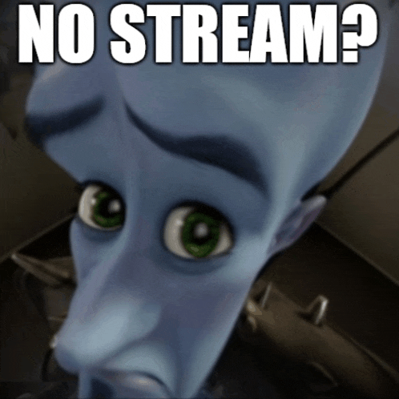

> ⚠️ Firefox is (maybe??) not supported as a viewer. Firefox's WebRTC stack handles certain RTCP feedback messages differently and tends to stall on the DTLS handshake with ice-lite servers. Chromium-based browsers work fine. PRs welcome if you figure it out.

# sharkord-whip


A [Sharkord](https://github.com/Sharkord/sharkord) plugin that lets OBS stream directly into a voice channel using the [WHIP protocol](https://www.rfc-editor.org/rfc/rfc9725).

If you want to understand how this works under the hood, or you're thinking about writing your own WHIP server, check out [how-a-stream-works.md](./how-a-stream-works.md). It walks through the full SDP/ICE/DTLS/SRTP flow with ASCII diagrams, common pitfalls, and a glossary.

## Installation

Follow [THESE](https://sharkord.com/docs/plugins/installation) steps :).

or:

1. Download the latest release from the [Releases](https://github.com/remynaps/sharkord-whip-plugin/releases) page.
2. Move the `sharkord-whip-plugin` folder to your Sharkord plugins directory, typically `~/.config/sharkord/plugins`.


## Setup

### 1. Docker

Expose the WHIP port and a UDP/TCP range for media:

```bash
docker run \
  -p 4991:4991/tcp \
  -p 8088:8088/tcp \
  -p 40000-40020:40000-40020/tcp \
  -p 40000-40020:40000-40020/udp \
  -v ./data:/root/.config/sharkord \
  --name sharkord \
  sharkord/sharkord:latest
```

### 2. Firewall

```bash
sudo ufw allow 40000:40020/udp
sudo ufw allow 40000:40020/tcp
sudo ufw reload
```

### 3. Docker checksum offloading (Docker only)

Docker's NAT breaks UDP checksums by default, which causes ICE to silently fail. Fix it:

```bash
sudo ethtool -K docker0 tx-checksumming off
```

> ⚠️ **This resets on every reboot.** Add it to `/etc/rc.local` or a systemd service to make it stick. If streaming suddenly stops working after a server restart, this is probably why.

### 4. Plugin settings

| Setting | Description | Default |
|---------|-------------|---------|
| WHIP Port | Port for the HTTP signaling server | `8088` |
| Stream Key | Bearer token OBS sends for auth | `changeme` |
| Public URL | Your reverse proxy URL (e.g. `https://stream.example.com`) | _(empty)_ |
| RTP Min Port | Start of media port range, must match Docker `-p` | `40000` |
| RTP Max Port | End of media port range, must match Docker `-p` | `40020` |
| Max Concurrent Streams | Max simultaneous OBS streams. 0 = unlimited | `5` |
| Stream Name | Default stream name shown in the channel | `OBS Stream` |

### 5. OBS settings

Go to **Settings -> Stream**:

```
Service:      WHIP
Server:       https://stream.example.com/whip/<channel_id>
Bearer Token: <your stream key>
```

Get the exact URL for your current channel with `/whip_info` in Sharkord.

**Custom stream name**

You can set a custom name for your stream by appending `?title=` to the server URL:

```
https://stream.example.com/whip/3?title=Tinkywinky%27s%20Stream
```

If not set, it falls back to the Stream Title setting, then to `OBS Stream`.

---

## Commands

| Command | What it does |
|---------|-------------|
| `/whip_start` | Start the WHIP server |
| `/whip_stop` | Stop the server and end all active streams |
| `/whip_info [channel_id]` | Show OBS connection details for a channel |

---

## Port reference

```
8088/tcp            WHIP signaling (HTTP). OBS sends the SDP offer here.
                    Fine to put behind a reverse proxy on 443.

40000-40020/tcp+udp RTP media. The actual video and audio packets.
                    Needs to be open in your firewall and forwarded in Docker.
                    UDP is used by default, TCP is a fallback.
```

---

## Troubleshooting

**Stream stays on "Connecting" for a few seconds then fails**

Check that your RTP port range is open in both UFW and Docker. Also run `sudo ethtool -K docker0 tx-checksumming off` and check if the server was rebooted recently since that resets it.

**DTLS fails within 1 second of ICE connecting**

This is an active rejection, not a timeout. Usually a certificate mismatch. Try restarting the Sharkord container to get a fresh cert, then restart OBS fully before trying again -- don't just stop/start streaming, OBS caches the remote cert.

**"Invalid SDP" or OBS rejects the connection immediately**

Usually an OBS version issue. Update to the latest release.

**OBS sends DELETE and gets a 404**

Expected behaviour. OBS sends DELETE when you stop streaming, but if everyone left the voice channel before you stopped streaming, the session was already cleaned up on our side. Nothing to worry about.

**"Stream limit reached" in OBS**

The max concurrent streams limit was hit. Either stop an existing stream first or increase the limit in plugin settings. Set it to `0` to disable the limit entirely.

**High CPU**

mediasoup forwards RTP packets without transcoding so CPU scales with bitrate not resolution. If it's higher than expected, check `top` inside the container to see what's actually eating it.